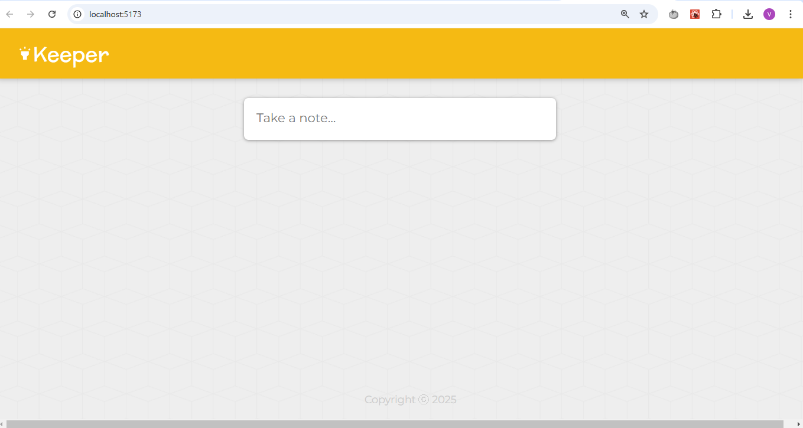
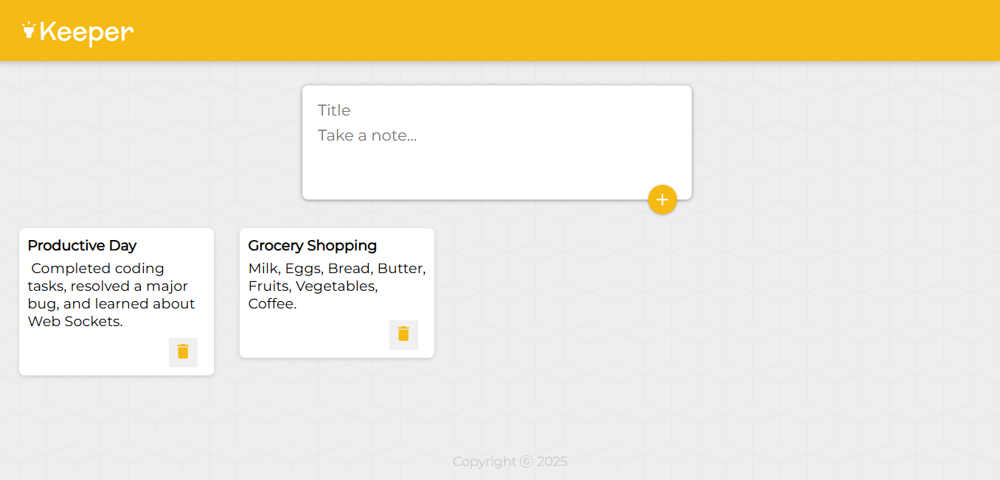

# KeeperDashboard
Created with CodeSandbox
Keeper App is a versatile application designed to help you manage and organize your tasks, notes, and personal data efficiently. Whether you're tracking your daily to-do list, saving important notes, or keeping your information secure, Keeper App is here to help you stay organized.

